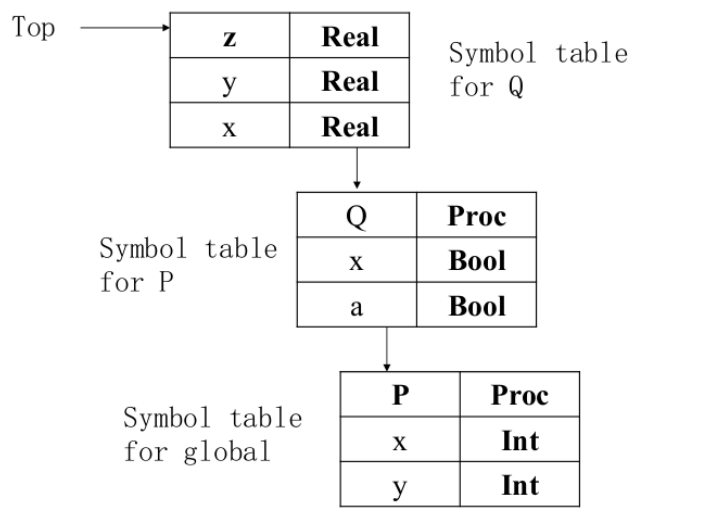

# Programing Assignment II 文档

本次实验是组队实验，请仔细阅读组队要求，并合理进行分工合作。
本实验中需要使用 visitor pattern 完成对程序的类型检查。

注意：组队实验意味着合作，但是小组间的交流是受限的，且严格**禁止**代码的共享。
除此之外，如果小组和其它组进行了交流，必须在根目录 `README.md` 中记录下来交流的小组和你们之间交流内容。

## 基础知识

### 声明检查

在 Python 中的变量有四个作用域

| 作用域                  | 英文解释                  | 英文简写 |
| ----------------------- | ------------------------- | -------- |
| 局部作用域（函数内）    | Local (function)          | L        |
| 外部嵌套函数作用域      | Enclosing function locals | E        |
| 函数定义所在模块作用域  | Global (module)           | G        |
| Python 内置模块的作用域 | Builtin                   | B        |

在访问变量时，
先查找本地变量，
然后是包裹此函数外部的函数内的变量，
之后是全局变量，
最后是内建作用域内的变量，
即： L –> E -> G -> B.

```python
class Real(object):
    value: int = 0
    def __init__(self: "Object", val: int) -> object:
        self.value = val
    def __add__(self: "Object", other: "Object") -> Real:
        return Real(self.value + other.value)

x: int = 0
y: int = 1

def P() -> int:
    x: bool = True
    a: bool = False

    def Q() -> Real:
        x: Real = None
        y: Real = None
        x = Real(1)
        y = Real(1)
        return x + y

    return Q().value
```



#### 全局变量检查

函数内定义的变量，在函数内部可以访问，但是不能访问函数外部的变量。`global` 关键字可以用来声明一个全局变量。

```python
x: int = 0

def f():
    global x # 需要在内部声明 global x 才能获得外部变量。
    x = 1 
    print(x)
```

#### 函数内变量检查

Python 支持嵌套定义函数，每次进入函数时需要进入函数本地变量的 scope.
访问外部嵌套函数作用域中的变量，需要使用 `nonlocal` 关键字。
访问全局变量，需要使用 `global` 关键字。

```python
x: int = 1
def foo():
    global x
    y: int = 0
    i: int = 0

    def bar():
        nonlocal y
        print(y)
        y = y + 1

    y = 10
    while i < 10:
        bar()
        i = i + 1
foo()
```

#### Class 变量检查

```python
c: animal = None
class animal(object):
    makes_noise: bool = False

    def make_noise(self: "animal") -> object:
        if (self.makes_noise):
            print(self.sound())

    def sound(self: "animal") -> str:
        return "???"


class cow(animal):
    def __init__(self: "cow"):
        self.makes_noise = True

    def sound(self: "cow") -> str:
        return "moo"

c = cow()
c.make_noise()  # Prints "moo"
```

Predefined classes 有 object, int, bool, str, list.
都有 `__init__` 方法，以及 attribute。
自定义 class 可以自定义 `__init__` 方法，支持继承。

```python
class A(object):
    a: int = 42
    def bar(self: "A") -> int:
        print("A bar")
        return self.a

class B(A):
    def __init__(self: "B"):
        print("B init")

class C(B):
    c: bool = True
    def __init__(self: "C"):
        self.a = 64
        print("C init")
    def bar(self: "C") -> int:
        print("C bar")
        print(self.c)
        return self.a

d: str = "abc"
a: A = None

d = input()
if d == "c":
    a = C()
else:
    a = B()

print(a.bar())
```

输入 `c` 会输出：

```
C init
True
C bar
True
64
```

其他输入会输出：

```
B init
A bar
42
```

支持虚函数。

#### List 变量检查

List 实现上是一个 class，所以定义的时候和 class 一样。

```python
x: [[bool]] = None
y: str = "Hello"
z: [int] = None
w: [int] = None
i: int = 0

x = [[True, False], [False, True]]
z = [1, 2]

w = z + [3, 4]
for i in w:
    print(i)

i = 0
while i < len(z):
    print(x[i][1])
    print(y[i])
    i = i + 1
```

输出：

```
1
2
False
H
True
e
```

注意 list 没有 append 方法.
可以说 list 对象是不可变的。
只能将几个 list 相加，得到一个新的 list.

## 类型检查

此项实现在 `TypeChecker` 类中。

### 类型语义

int/bool/str 不能被继承，所有定义的 class 都是继承 object.
有两个辅助类型 `<None>`,`<Empty>`.

在 [hierachy_tree.hpp](../../include/semantic/hierarchy_tree.hpp) 中，我们提供了一个类来表示类型的继承关系。
不过它不能处理 `<None>`, `<Empty>` 和 `list` 的继承关系。

具体细节见 [ChocoPy Language Reference](../chocopy_language_reference.pdf) 的 2.4 Type hierarchy.

### 类型推导

此部分详见 [ChocoPy Language Reference](../chocopy_language_reference.pdf) 的 5. Type rules.
首先需要定义现在所在的 type environment，由一个四元组定义 $<O,M,C,R>$, 定义了 `TypeChecker` 的检查环境，
$O$ 由全局 `SymbolTable` 决定，
$M$ 由 `ClassDefType` 决定，
$C$ 由局部 `SymbolTable`决定，
$R$ 由 `FunctionDefType` 决定。

以 `+` 为例，

$$
O,M,C,R \vdash e_{1}: int\\
O,M,C,R \vdash e_{2}: int\\
\frac{op\in\{+,-,*,//,\%\}}{O,M,C,R \vdash e_{1}\text{ op }e_{2}:int}
$$

这个规则写在 `void TypeChecker::visit(parser::BinaryExpr &node)` 中，
若 `operator` 是 `+,-,*,//,%` 判断两个操作数都需为 int 类型。

其他规则请同学自行查阅并实现。

## 错误检测

在 [chocopy_semant.hpp](../../include/semantic/chocopy_semant.hpp) 中定义了 `SemanticError` 类，
提供的代码中给出了使用的例子。

对于错误的程序，只需报告第一个错误即可。

## 实验要求

本次实验需要各位同学根据 ChocoPy 的语义补全 [chocopy_semant.cpp](./src/semantic/chocopy_semant.cpp) 文件，完成完整的语法分析器，能够输出识别出错误。

### 主要工作

1. 了解 [visitor pattern](./visitor.md) 基础知识和理解 ChocoPy 语义
2. 了解 `src/semantic/chocopy_semant.cpp` 中给出的样例语义检查
3. 补全 `src/semantic/chocopy_semant.cpp` 文件，可以添加其他 `ASTAnalyzer`. 如果你需要其他改写的代码可以自行改写。
4. 写出内存安全的代码（使用 fsanitize=address 检查）
5. 在 code interview 解释你们的设计，遇到的困难和解决方案

### 示例

文本输入：

```c
a: int = 1
```

结果应为：

```json
{
  "kind": "Program",
  "declarations": [
    {
      "kind": "VarDef",
      "value": {
        "inferredType": {
          "className": "int",
          "kind": "ClassValueType"
        },
        "kind": "IntegerLiteral",
        "value": 1
      },
      "var": {
        "identifier": {
          "kind": "Identifier",
          "name": "a"
        },
        "kind": "TypedVar",
        "type": {
          "className": "int",
          "kind": "ClassType"
        }
      }
    }
  ],
  "errors": {
    "kind": "Errors",
    "errors": []
  },
  "statements": []
}
```

### 实现指南

我们在 [chocopy_semant.cpp](../../src/semantic/chocopy_semant.cpp) 留下了一些示例代码，能够检查

```python
a: int = 1
a + 1 # 这行没问题
"114" + 514 # 这行会报错
```

[ValueType.hpp](../../src/include/../../include/semantic/ValueType.hpp) 添加了新的对象类型 `ValueType`, `ClassValueType`, `ListValueType`.
这些将被用来存储类型检查后推断出的程序表达式的类型信息。
注意，这些类型几乎与 `TypeAnnotation` 和它的两个子类型完全相似。
   
`TypeAnnotation` 和 `ValueType` 之间的区别在于，后者没有继承 Node，因为在语义分析期间分配的类型实际上并不存在于源代码中。
  
`Expr` 类有一个新的属性 `inferredType`，它表示表达式的类型。

#### `SymbolTable`

```cpp
class SymbolTable {
public:
    /** A table representing a region nested in that represented by PARENT. */
    explicit SymbolTable(SymbolTable *parent0) { this->parent = (SymbolTable *)parent0; }
    SymbolTable() { this->parent = nullptr; }
    /** Returns the mapping in this scope or in the parent scope using a recursive traversal */
    template <typename T> T get(const string &name);
    /** Adds a new mapping in the current scope, possibly shadowing mappings in the parent scope. */
    template <typename T> SymbolTable *put(const string &name, T value);
    map<string, SymbolType *> *tab = new map<string, SymbolType *>();
    SymbolTable *parent;
    map<string, int> class_tag_;
}
```

通过一个 std::map 保存名称到类型的映射。
`SymbolTable` 是树形结构，用 `parent` 属性刻画。

可以通过 `get<T>`, `declares<T>` 和 `put<T>` 方法获取和添加符号表中的符号。
具体的方法查看 [SymbolTable.hpp](../../include/semantic/SymbolTable.hpp)

全局的 `SymbolTable` 在 `Program::symbol_table`.
函数和类的 `SymbolTable` 在 `FunctionDefType::current_scope` 和 `ClassDefType::current_scope` 中。

#### `SymbolType` 和 `ValueType`

```cpp
class SymbolType {
   public:
    virtual ~SymbolType() = default;
    virtual constexpr bool is_value_type() const { return false; }
    virtual constexpr bool is_list_type() const { return false; }
    virtual constexpr bool is_func_type() const { return false; }
    virtual const string get_name() const = 0;
    virtual json toJSON() const = 0;
};
```

`SymbolType` 是一个纯虚类，表示了所有在 `SymbolTable` 内的类型。
`ValueType`, `ClassDefType` `FunctionDefType` 都继承自 `SymbolType`。

```cpp
class ValueType : public SymbolType {
   public:
    ValueType() = default;
    bool is_value_type() const override { return true; }
    static shared_ptr<ValueType> annotate_to_val(
        parser::TypeAnnotation *annotation);
    const string get_name() const override;
};
```

`ClassValueType` 和 `ListValueType` 都继承自 `ValueType`.
`annotate_to_val()` 从 `TypeAnnotation` 转换到 `ValueType`.

#### `ClassDefType` 和 `FunctionDefType`

`ClassDefType` 和 `FunctionDefType` 都继承自 `SymbolType`. 储存了类和函数的定义信息。
例如，在遍历到 `parser::ClassDef` 就可以创建一个 `ClassDefType` 并且插入到全局的 `SymbolTable` 中。

```cpp
class FunctionDefType : public SymbolType {
   public:
    string func_name;
    shared_ptr<ValueType> return_type;
    std::vector<shared_ptr<SymbolType>> params;
    SymbolTable current_scope;
    bool is_func_type() const final { return true; }
    const string get_name() const final { return func_name; }
    json toJSON() const override;
};
class ClassDefType : public SymbolType {
   public:
    ClassDefType(string parent, string self)
        : super_class(std::move(parent)), class_name(std::move(self)){};

    const string get_name() const override { return class_name; }
    virtual json toJSON() const override { abort(); }
    std::vector<string> inherit_members;
    string super_class;
    string class_name;
    SymbolTable current_scope;
};
```

### 编译、运行和验证

* 编译

  ```bash
  cd chocopy # 项目根文件夹
  cmake -S . -B build -G Ninja
  cmake --build build
  ```

  若编译成功，则将在 `./build/` 下生成 `semantic`。

* 运行

  ```shell
  cd chocopy
  ./build/semantic               # 交互式使用（不进行输入重定向）
  # <在这里输入 ChocoPy 代码，如果遇到了错误，将程序将报错并退出。>
  # <输入完成后按 Ctrl - D 结束输入，此时程序将输出解析 json。>
  ./build/semantic test.py  # 不使用重定向，直接从 test.py 中读入
  ```

* 验证

  本次试验测试案例较多，为此我们将这些测试分为两类：

    1. sample: 这部分测试均比较简单且单纯，适合开发时调试。
    2. fuzz: 由 fuzzer 生成的 Python 文件。
    3. student: 这部分由同学提供。

  我们使用 `check.py` 进行评分。`check.py` 会将 `semantic` 的生成结果和助教提供的 `*.py.out.typed` 进行比较。

  ```shell
  cd chocopy/tests
  ./check.py --pa 2
  ```

  **请注意助教提供的 `testcase` 并不能涵盖全部的测试情况，完成此部分仅能拿到基础分，请自行设计自己的 `testcase` 进行测试。**

### 提供可用的测试用例

每组学生需要在 `tests/pa2/student/` 放置至少 4 个有意义的 `*.py` 测试案例，不能通过编译的部分要以 `bad_` 开头。

你的测试案例将被用来评估其他人的代码，你可以降低别人的分数。

### 评分

1. 基本测试样例[60pts]
2. Fuzzer 测试[5pts]
3. Student 测试[10pts]
4. 提供 Test Case[5pts]
5. Code interview (memory safety check)[20pts]
